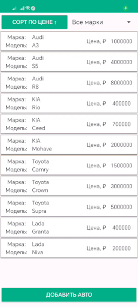

# CarsList
Тестовое задание по SQL в андроиде. Список автомобилей.
Используется библиотека Room. Читается QR код с помощью GmsBarcodeScanner

При установке вместе с приложением ставится база SQLite с несколькими заполненными полями. 
Можно добавлять, удалять и редактировать автомобили в базе. 
Список можно фильтровать по марке, сортировать по стоимости (по возрастанию, по убыванию).
В активности редактирования автомобиля есть возможность сканировать QR код и сохранить данные в базу.

 
